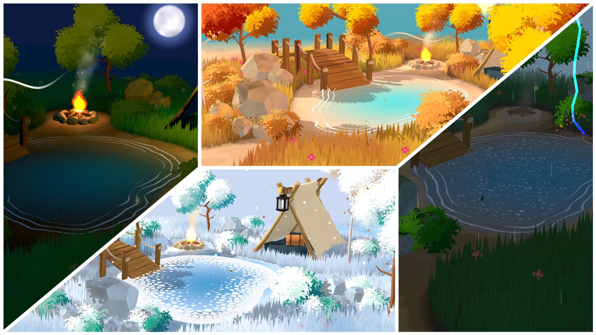

# Elemental Serenity



An interactive 3D nature diorama built with WebGL and Three.js.

## 🚀 Getting Started

### Prerequisites

- Node.js 18+
- npm or yarn

### Installation

```bash
npm install
```

### Development

```bash
npm run dev
```

### Build for Production

```bash
npm run build
```

### Preview Production Build

```bash
npm run preview
```

### Host on Local Network

```bash
npm run host
```

## 🎮 Debug Mode

Add `?mode=debug` to the URL to enable:

- Performance monitoring (FPS, draw calls)
- lil-gui controls for tweaking parameters
- Verbose console logging

## 🏗️ Project Structure

```
src/
├── main.js              # Entry point and UI initialization
├── reveal.js            # Shader-based reveal transition
├── config/              # Asset paths and configuration
├── utils/               # Console styling utilities
├── Game/
│   ├── Game.class.js    # Main game orchestrator
│   ├── Core/            # Renderer and camera setup
│   ├── UI/              # Music controls, lightning button, toasts
│   ├── Utils/           # Audio, events, resource loading, timing
│   └── World/
│       ├── Components/  # Bridge, bush, camp, fire, fog, rain, etc.
│       ├── Managers/    # Biome, grass, bush, season, environment
│       └── Systems/     # Lightning and particle systems
└── Shaders/
    ├── Chunks/          # Chunks to modify builtin shaders from three.js (grass, ground, rocks, water)
    └── Materials/       # Full shader materials (fire, fireflies, skydome, etc.)

public/
├── audio/               # Music and sound effects
├── draco/               # Draco decoder for compressed models
├── map/                 # Environment maps (day, day2, night)
├── models/              # GLB 3D models
└── textures/            # Texture assets organized by type
```

## 🛠️ Tech Stack

| Layer       | Technology       | Purpose                       |
| ----------- | ---------------- | ----------------------------- |
| Build       | Vite 6.0         | Fast dev server with HMR      |
| 3D Engine   | Three.js 0.182   | WebGL rendering               |
| Animation   | GSAP 3.14        | Smooth tweening and timelines |
| Shaders     | GLSL             | Custom visual effects         |
| Debug UI    | lil-gui          | Runtime parameter controls    |
| Performance | three-perf       | FPS and draw call monitoring  |
| Styles      | Sass             | SCSS preprocessing            |
| RNG         | Mersenne Twister | Deterministic randomness      |

## 📱 Mobile Support

- Touch-friendly UI controls
- Haptic feedback for button presses and lightning effects
- Responsive canvas sizing
